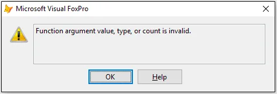
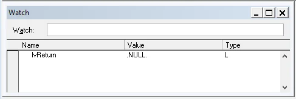
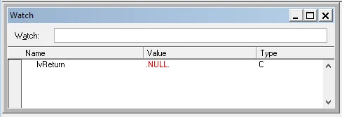

While working on a customer's project in Microsoft Visual FoxPro (VFP) I was addressed with a curious case where the code execution failed given a specific user interaction.

On first inspection and stepping through the lines of code I noticed that the return value of a called function got NULL assigned to it, and that was the reason the actual calling code failed. Further investigation then actually revealed that the processing function had an incomplete instantiation of the variable containing the return value.

Let me show you the issue with a few lines of code.

## Function argument value, type, or count is invalid

First, let's start off with the calling code somewhere in the application. It reads like so:

```
LOCAL lcIdentifier

lcIdentifier = UPPER(GetValue("Please enter ID", "ABC"))
```

The task is to ask the user for some input regarding an ID number. The expected outcome is any kind of string value. Unfortunately, that line of code threw an exception due to invalid value / type.



Now, let's have a look at the called function and how it has been implemented.

```
FUNCTION GetValue(tcMessage, tvDefault)
  LOCAL lvReturn
  
  *-- Run some dialog to ask for value
  lvReturn = DoForm("GetValueDialog", tcMessage, tvDefault)
  
  RETURN lvReturn
ENDFUNC
```

**Note:** It is common among VFP developers to hint the scope and type of a variable using the first two characters. Here it's either `t` or `l` to express that it is a passed parameter or a LOCAL scoped variable, and `c` or `v` stands for Character or Variant data type respectively.

The relevant part in the source code above is that the form, here a modal dialog, would return `NULL` on cancellation. In general, this isn't really a problem but there can be and there are issues with this kind of approach. Just not where you would except them. But let me explain this.

## Finding the root cause

Calling the `UPPER` function in VFP with `NULL` as parameter does not cause the error message from above. You can easily verify this in the VFP Command window like this:

```
? UPPER(NULL)		&& outputs .NULL. on the screen
```

Okay, it's not UPPER, right? But where is the actual problem now?

Well, actually the passed parameter into the `UPPER` function is causing the issue. The root cause although is located in the function `GetValue` and is related to an incomplete or better said an inappropriate instantiation of the variable `lvReturn`.

When you run the VFP debugger and step through the source code you will notice in the Watch window that the variable of the return value is declared as a logical type:



This is caused by the `LOCAL` command. And now, passing the variable into the `UPPER` function throws the error message as expected.

```
? UPPER(lvReturn)
```

Declaring any variable in VFP defines it as a logical data type first. In our case though, we are somehow expecting a return type of string (or character). And given the untyped nature of Visual FoxPro parameters and variables it is up to the developer to take care of this properly.

## How to fix it?

The implementation of the function `GetValue` above does not take the incoming type of the default value into consideration. Changing the source code like so:

```
FUNCTION GetValue(tcMessage, tvDefault)
  LOCAL lvReturn
  lvReturn = tvDefault	&& "assign" expected data type to be returned
  lvReturn = Null
  
  *-- Run some dialog to ask for value
  lvReturn = DoForm("GetValueDialog", tcMessage, tvDefault)
  
  RETURN lvReturn
ENDFUNC
```

changes the data type of the return variable into the expected return type.

When we have a look at the Watch window in the VFP debugger now, we will discover that the type has changed:



Although the value is still `NULL` this will not throw the error message anymore.

```
? UPPER(lvReturn)		&& outputs .NULL. on the screen
```

## Take away from this

Given the long history of Microsoft Visual FoxPro (VFP) being an untyped programming language requires a certain amount of discipline from each software developer. Writing VFP code is really easy and really fast but there are those little notches you should be aware of.

Given the discussed scenario, I would like to add that the original source code had been written somewhere around the year 1999 (!), and had been adjusted from time to time. But it is only now that this particular issue had been isolated and corrected for good.

> Always declare your variables **and** more importantly assign the intended data type to it before use.

Applying this practice will stabilise your VFP source code. At least, I can report that the number of invalid type error messages in my client's project has been decreased since then.

<small>Image credit: Erwin Voortman</small>