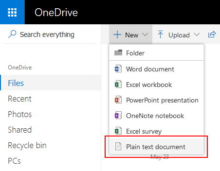
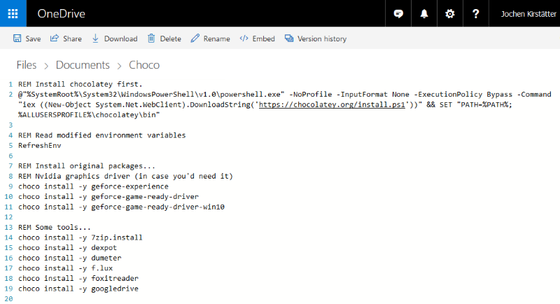
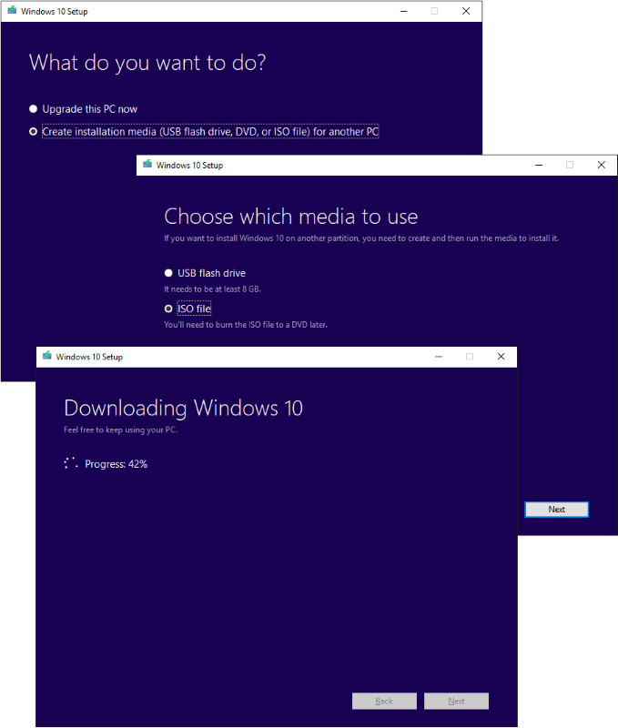
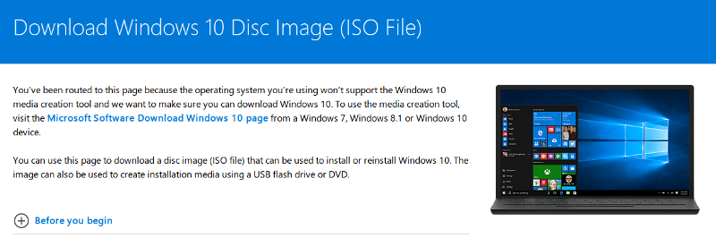
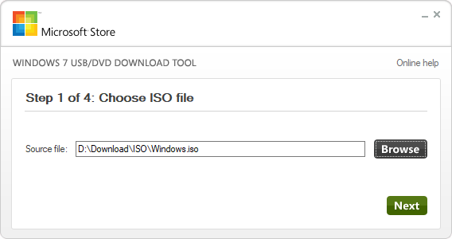
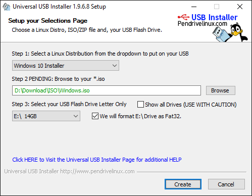
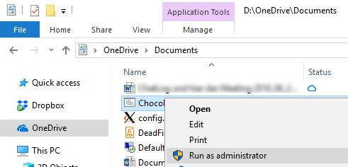

Perhaps an unusual blog title this time. Somehow, it is actually based on a few exchanges I had with other peers over various social media networks, including Twitter, Google+ and Facebook. Over the past few weeks there had been a few postings about struggles, obstacles and fears connected to a full installation of a Windows 10 system. The following article is about my process of setting up a fresh machine quickly, and hopefully it covers some areas where you might be able to take away something.

Some might say that it is a lot easier to install Linux compared to Windows or macOS. Others mentioned that it is painful to install necessary software packages in order to be able to actually use a Windows system productively. Here is an example that sparked the discussions:

> I know. We are past the era of Microsoft bashing, especially since Satya Nadella took office. But, personally, I am always amazed by what a Linux distribution gives you compared to a Windows installation: an OS, tools, programming languages, browsers, etc: a whole house! Discuss. [pic.x.com/lm2zttceFi](https://t.co/lm2zttceFi)
>
> — Avinash Meetoo (@AvinashMeetoo) [July 20, 2018](https://x.com/AvinashMeetoo/status/1020262299347705856?ref_src=twsrc%5Etfw)

Overall I have to admit that I do not agree with that in general knowing a few bits and pieces about how to make it simpler and more comfortable in regards to software management in Windows. Maybe even offering a similar experience to using `apt` in Linux.

That said, using a cloud storage client like [OneDrive](https://onedrive.live.com/) and [Chocolatey](https://chocolatey.org/) provide the right combination to allow a quick and easy completion of a fresh Windows installation towards your preferred software applications.

## Prerequisites

Good preparation is key to a good start. In order to complete each step in this tutorial I recommend you to have the following or similar options ready:

- USB pendrive; at least 8GB
- Windows 10 ISO file; latest build preferably.
- OneDrive account and your credentials to login.
- Decent bandwidth on your internet connection.

In general this is going to work with any cloud storage provider other than OneDrive, ie. Drive, Dropbox, etc. you name it. The actual advantage to use Microsoft OneDrive is that it comes built-in in Windows 10 and does not require any additional download or installation.

## Plan and prepare ahead

Now it is time to prepare the actual *magic* of the post-installation step in Windows 10. In OneDrive - either using an existing machine or directly online - create a new command-line batch file using either `.cmd` or `.bat` file extension.

**Note:** In OneDrive online it is not possible to set the file extension. If you want to create a batch file with `.cmd` file extension you have to do it on an existing machine and upload the file into OneDrive.



In this article I'm going to use the file name `Choco.cmd` and I prefer to create it below the `Documents` folder.



Add the Chocolatey installation right at the top, as described here: [Install with cmd.exe](https://chocolatey.org/install):

```
REM Install chocolatey first.
@"%SystemRoot%\System32\WindowsPowerShell\v1.0\powershell.exe" -NoProfile -InputFormat None -ExecutionPolicy Bypass -Command "iex ((New-Object System.Net.WebClient).DownloadString('https://chocolatey.org/install.ps1'))" && SET "PATH=%PATH%;%ALLUSERSPROFILE%\chocolatey\bin"

REM Read modified environment variables
RefreshEnv
```

Followed by the software applications you would like to have. Here's a small excerpt from my package list:

```
REM Install original packages...
REM Nvidia graphics driver (in case you'd need it)
choco install -y geforce-experience
choco install -y geforce-game-ready-driver
choco install -y geforce-game-ready-driver-win10

REM Some tools...
choco install -y 7zip.install
choco install -y dexpot
choco install -y dumeter
choco install -y f.lux
choco install -y foxitreader
choco install -y googledrive
choco install -y imageresizerapp
choco install -y notepadplusplus.install
choco install -y jpegtran
choco install -y paint.net
choco install -y skype
choco install -y smplayer
choco install -y treesizefree
choco install -y zoomit

REM an Office suite
choco install -y libreoffice-fresh
REM choco install -y Office365ProPlus

REM Essential fonts ;-)
choco install -y dejavufonts
choco install -y FiraCode
choco install -y hackfont
choco install -y inconsolata
choco install -y RobotoFonts

REM More web browsers...
choco install -y Firefox
choco install -y GoogleChrome
choco install -y GoogleChrome.Canary

REM Development stuff...
choco install -y dotnet4.6.2
choco install -y dotnet4.7.2
choco install -y dotnetcore
REM Fun with Visual Studio 2017... other versions are available too
choco install -y VisualStudio2017Professional
choco install -y visualstudio2017-workload-netweb
choco install -y visualstudio2017-workload-netcoretools
choco install -y vscode

REM Install WebPI packages
choco install -y IISExpress10 -source webpi
choco install -y WindowsAzurePowershellGet -source webpi
choco install -y WindowsInstaller45 -source webpi
```

At the time of writing this blog article there are more than 6,000 unique packages available through Chocolatey. Should be okay to create a well-prepped Windows system. Feel free to explore and search the directory of [community maintained packages](https://chocolatey.org/packages) on the Chocolatey website.

**Pro-Tip:** Use multiple batch files for different types of Windows 10 machines. Assemble a core file that is common for all your installations, and then have various other files ready, ie. `Choco_Core.cmd` and something like `Choco_Development.cmd`, `Choco_Gaming.cmd`, `Choco_Kids.cmd`, etc. to specialise the system. You get the idea.

With the preparations complete, let's start with the installation of Windows 10.

## Get a Windows 10 ISO

First, get the latest build of Windows 10 that is available online from Microsoft. There are several options available depending on where you are actually starting from.

Purchase and [Get Windows 10](https://www.microsoft.com/en-us/windows/get-windows-10) online from Microsoft directly.

[Download Windows 10](https://www.microsoft.com/en-us/software-download/windows10) with the Update Assistant that can help you update to the latest version of Windows 10. Use this option when you are already running Windows 7, 8.1 or 10, and you want the latest build.



**Note:** In case that you are using an operating system other than Windows Microsoft is going to route you to a page that offers you the download of a Windows 10 ISO file directly. You can choose the edition from the drop-down list.



Joining the [Windows Insider Program](https://insider.windows.com/) gives you early access to the upcoming builds of Windows 10. You can download an ISO of [Windows 10 Insider Preview](https://www.microsoft.com/en-us/software-download/windowsinsiderpreviewiso) to start your installation.

And last but not least, Microsoft offers fully operational trial versions of Windows 10 as virtual machine images here: [Get a Windows 10 development environment](https://developer.microsoft.com/en-us/windows/downloads/virtual-machines)

Either way you need a valid license key to activate Windows 10 after a few days.

## Prepare an USB pendrive

Since laptops commonly aren't equipped with a CD/DVD drive anymore the best option might be to get a fast USB pendrive to put the Windows 10 installation files onto. A capacity of at least 8GB is needed and works perfectly.

Depending on your taste you might choose one of the following options to burn the Windows ISO file on the USB pendrive:

[Windows USB/DVD Download Tool](https://www.microsoft.com/en-us/download/details.aspx?id=56485) *(ignore the Windows 7 attribution, it just works)*



[UUI - Universal USB Installer](https://www.pendrivelinux.com/) *(don't fear the Linux stuff)*



Or any other software that is capable to create a bootable USB pendrive from an ISO file. You can do that step on Linux or macOS, too.

I haven't tried it myself but alternatively it should be possible to use a fast SD card - minimum Class 10 or even an Ultra 1 - with USB adapter to run the setup of Windows. More on that in a separate article.

## Install Windows 10 (as usual)

Equipped with your newly created USB pendrive it is now time to use it on the targeted machine. To be able to run the installation from the USB pendrive either check the boot device sequence in the system's BIOS or choose the USB drive during the startup phase of the computer.

Follow the Windows 10 setup instructions to complete the initial installation. The real fun begins after this step.

## Sign in into OneDrive

After completion of the Windows 10 installation and your first login you will most likely get a notification to Sign in into OneDrive. Please do so immediately and allow OneDrive to start the synchronisation process.

Access the file you created during the preparation step in your local OneDrive Documents folder. In case that you created the file directly in OneDrive online it is now best to change the file extension from `.txt` to `.cmd`.

**Note:** In case that you are using an older version of Windows 10 or even Windows 7/8.1 you can always use Internet Explorer or Microsoft Edge to login into [OneDrive online](https://onedrive.live.com/) and download the file.

## Launch the Chocolatey process

Open Windows Explorer to navigate into the OneDrive folder where you stored the batch file. Right click the file and choose the option `Run as administrator` to launch the remaining installation sequence.



Windows will present you the User Account Control (UAC) dialog which you confirm with `Yes` to allow this app to make changes to your device.

An administrative Command Line window will open and you can monitor and follow the progress of the automated Chocolatey installations.

```
C:\>@"%SystemRoot%\System32\WindowsPowerShell\v1.0\powershell.exe" -NoProfile -InputFormat None -ExecutionPolicy Bypass -Command "iex ((New-Object System.Net.WebClient).DownloadString('https://chocolatey.org/install.ps1'))" && SET "PATH=%PATH%;%ALLUSERSPROFILE%\chocolatey\bin"
Getting latest version of the Chocolatey package for download.
Getting Chocolatey from https://chocolatey.org/api/v2/package/chocolatey/0.10.11.
Extracting C:\Users\joki\AppData\Local\Temp\chocolatey\chocInstall\chocolatey.zip to C:\Users\joki\AppData\Local\Temp\chocolatey\chocInstall...
Installing chocolatey on this machine
Creating ChocolateyInstall as an environment variable (targeting 'Machine')
  Setting ChocolateyInstall to 'C:\ProgramData\chocolatey'
WARNING: It's very likely you will need to close and reopen your shell
  before you can use choco.
Restricting write permissions to Administrators
We are setting up the Chocolatey package repository.
The packages themselves go to 'C:\ProgramData\chocolatey\lib'
  (i.e. C:\ProgramData\chocolatey\lib\yourPackageName).
A shim file for the command line goes to 'C:\ProgramData\chocolatey\bin'
  and points to an executable in 'C:\ProgramData\chocolatey\lib\yourPackageName'.

Creating Chocolatey folders if they do not already exist.

WARNING: You can safely ignore errors related to missing log files when
  upgrading from a version of Chocolatey less than 0.9.9.
  'Batch file could not be found' is also safe to ignore.
  'The system cannot find the file specified' - also safe.
Chocolatey (choco.exe) is now ready.
You can call choco from anywhere, command line or powershell by typing choco.
Run choco /? for a list of functions.
You may need to shut down and restart powershell and/or consoles
 first prior to using choco.
Ensuring chocolatey commands are on the path
Ensuring chocolatey.nupkg is in the lib folder

C:\>RefreshEnv
Refreshing environment variables from registry for cmd.exe. Please wait...Finished..

C:\>choco install -y geforce-experience
Chocolatey v0.10.11
Installing the following packages:
geforce-experience
By installing you accept licenses for the packages.
...
```

Depending on your collection of software packages and internet bandwidth this might take a little while. Perhaps it is now time for a chocolate break.

## Why Chocolatey?

Because it is a solid choice for software management automation under Windows. Check out their website: [https://chocolatey.org/](https://chocolatey.org/)

- Chocolatey works with all existing software installation technologies like MSI, NSIS, InnoSetup, etc, but also works with runtime binaries and zip archives.
- Easily manage all aspects of Windows software (installation, configuration, upgrade, and uninstallation).

And because I absolutely love it to keep a Windows system up-to-date with the latest software packages available. Several times during the week I launch an administrative PowerShell prompt (pressing keys Win+X and A) to run the following command:

```
PS C:\> cup all -y
```

The command `cup` is a shortcut for `choco upgrade` which upgrades a package or a list of packages from various sources.

Which is very similar to `apt-get update && apt-get dist-upgrade` in Debian and Ubuntu.

## Virtual machines...

Using the above described approach gives you a reliable and consistent process to setup and install a Windows 10 machine. This is quite interesting in combination with virtual machines - both locally and cloud-based.  
Getting the batch file(s) from your cloud storage and then launch it in an elevated Command Prompt doesn't give you much room for errors.

## Now... Discuss.

What do you think? Does a *Windows distribution* like Chocolatey give you less than a Linux distribution? How do you install your software and keep it up-to-date?
